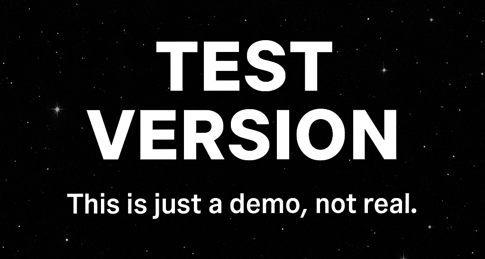

# 🌌 SPACE CODE

**Conquer Space IT — Modern programming courses from leading industry experts.**

[Visit Website](https://spacescode.netlify.app/)

---

## 🚀 About the Project

**SPACE CODE** is an online platform for learning modern IT technologies.  
We empower students to build practical skills and launch successful careers in IT.

- 💻 **150+ Courses**
- 🎓 **5000+ Graduates**
- ✅ **98% Employment Rate**
- 👨‍🏫 **50+ Industry Experts**

---

## 🌍 Supported Languages

- English  
- Polski  
- Русский  
- Українська  
- Español  
- Français  
- العربية  
- Deutsch  
- 中文

---

## 🎯 Courses

| Level          | Duration   | Focus                  | Main Technologies |
|----------------|------------|-----------------------|------------------|
| Beginner       | 6 months   | Frontend Development  | HTML5, CSS3, JS, React, Vue, TypeScript |
| Intermediate   | 8 months   | Backend Development   | Node.js, Python, Django, Flask, PostgreSQL, MongoDB |
| Intermediate   | 7 months   | Mobile Development    | React Native, Flutter, Swift, Kotlin |
| Advanced       | 10 months  | Data Science & AI     | Python, ML, Neural Networks, TensorFlow |
| Intermediate   | 9 months   | Game Development      | Unity, Unreal Engine, C#, C++ |
| Advanced       | 6 months   | DevOps Engineer       | Docker, Kubernetes, CI/CD, AWS |

---

## 👨‍🏫 Our Teachers

- **Alexey Petrov** — Senior Frontend Developer at Apple, 8+ years experience  
- **Maria Ivanova** — Lead Backend Developer at Google Dev, 10+ years experience  
- **Dmitry Sidorov** — Data Scientist at MonoBank, PhD, 12+ years experience  
- **Anna Kozlova** — DevOps Engineer at Telegram, 7+ years experience  

---

## 💬 Student Feedback

> "Excellent support at all stages of training. Mentors are always ready to help, and the career center really helps with employment. I recommend it to everyone!"  
> **— Maxim Orlov, Backend Developer at Allegro**

---

## 📈 Why Choose Us

- 🚀 **Modern Technologies** — Learn tools used in top IT companies  
- 👨‍🏫 **Experienced Mentors** — Developers from Google, Yandex, and Mail.ru  
- 💼 **Employment Guarantee** — 98% of graduates find work within 3 months  
- 🏆 **Recognized Certificates** — Valued by HR managers worldwide  
- 🔄 **Lifetime Access** — Always get course materials and updates  
- 💬 **Graduate Community** — Network with 5000+ IT professionals  
- 🌍 **International Projects** — Work with global teams  
- 📈 **Career Growth** — CV reviews, interview prep, and networking events  

---

## 📬 Contact Us

- **Address:** Warsaw, Chmielna 69, Office No. 321, 15th floor  
- **Phone:** +48 333 323 333 (Daily 9:00 – 21:00)  
- **Email:** info@spacecode.eu | support@spacecode.eu  
- **Messengers:** Telegram: @spacecode | WhatsApp: +48 333 323 333 | Instagram: @spacecode | X: @spacecode | LinkedIn: @spacecode

---

**© 2025 SPACE CODE. All rights reserved.**  
[Privacy Policy](#) | [User Agreement](#)
